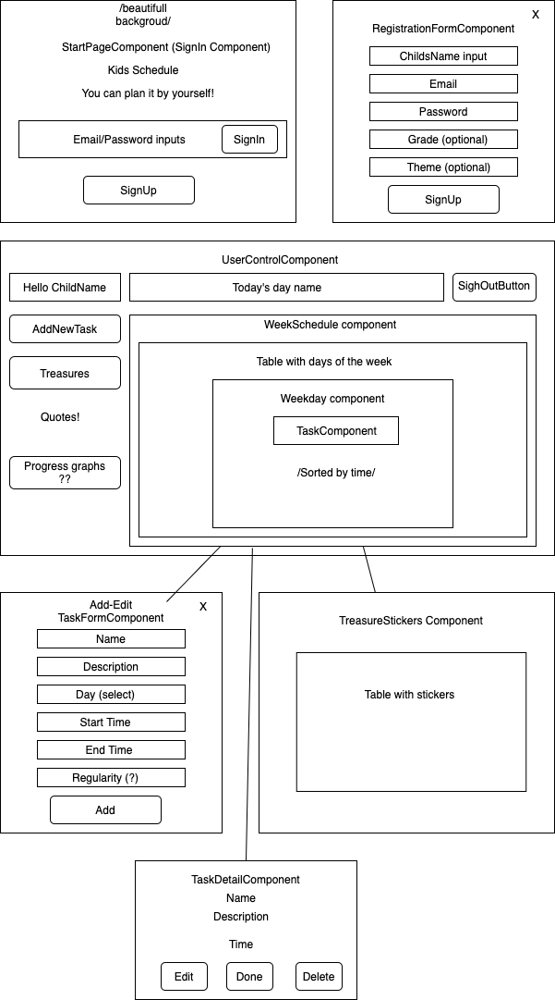

# Kids Schedule

#### React Redux FireBase application, 10/08/2020

#### By _**Evgeniya Chernaya**_

## Description

Kids Schedule application will help kids (users) track their daily tasks and motivate them to do it on time. 

## Setup/Installation Requirements

* Clone the repository to your desired directory (in terminal: git clone https://github.com/janecher/kids-schedule.git)
* Do "npm install" in terminal
* Do "npm run start" in the terminal to see the result in browser

## Specification

Component tree

 

* User can sign in and sign up with email/password 
* Main user page incledes: user name, today's week day, sign out buttton, sidebar with button to add a task and see the rewards, schedule table with day of the week columns 
* User can create a task and add it to corresponding part of the schedule table (by days of the week) 
* User can click on the task and see details
* On details component user can edit, done/undone, and delete task (edit, done, delete buttons) 
* Font color for done tasks changes to green, undone changes back to red color (default color is red)
* For each “done” task user will get a reward (sticker, that appears on stickerPage component) and motivate quote appears for 10 seconds on side bar
* User can click on treasures button and see stickerPage component with rewarded stickers
* User can sigh out with sign out button 

## FireBase collections

* User collection
* Tasks collection (has userId property)
* Stickers collection (has userId property)

## Known Bugs

_No known bags_

## Support and contact details

Contact me at _evgenya.chernaya@gmail.com_

## Technologies Used

  * React JS
  * Redux
  * JavaScript
  * JSX
  * HTML
  * CSS
  * Bootstrap
  * FireBase

### License

_This software is licensed under the MIT license_

Copyright (c) 2020 **Evgeniya Chernaya**