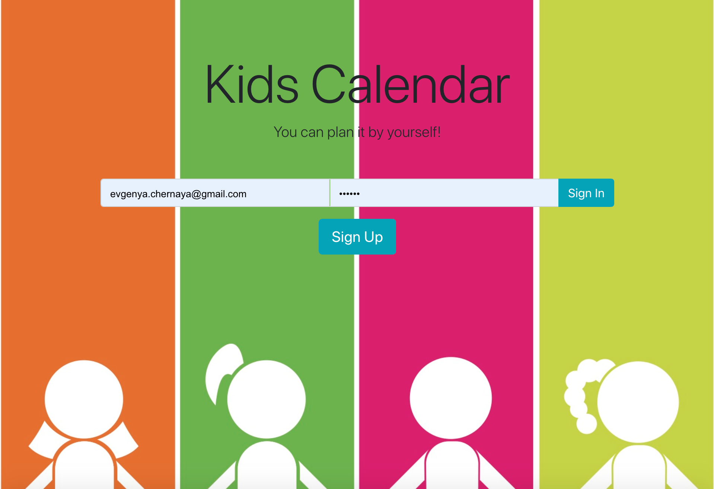
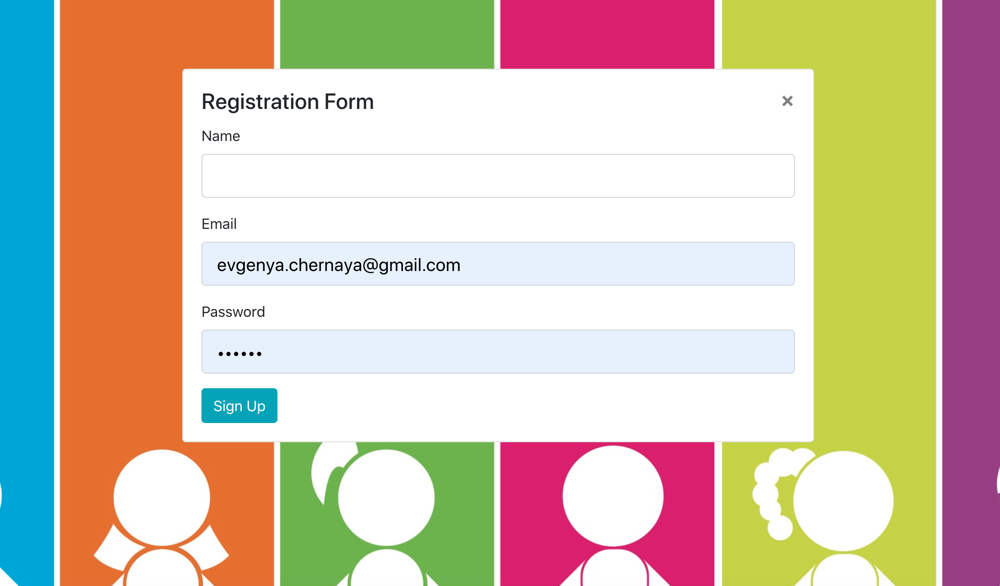
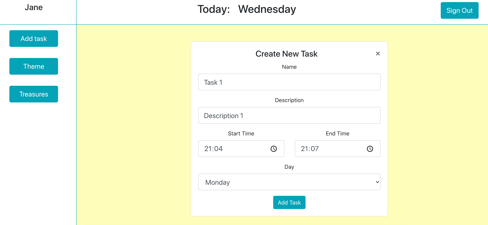
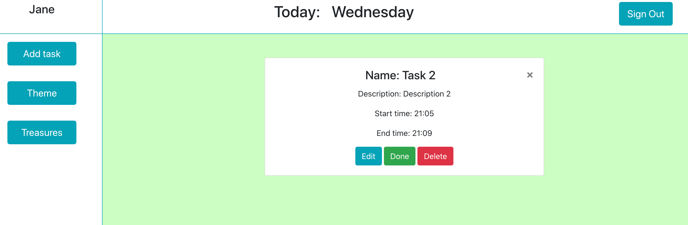
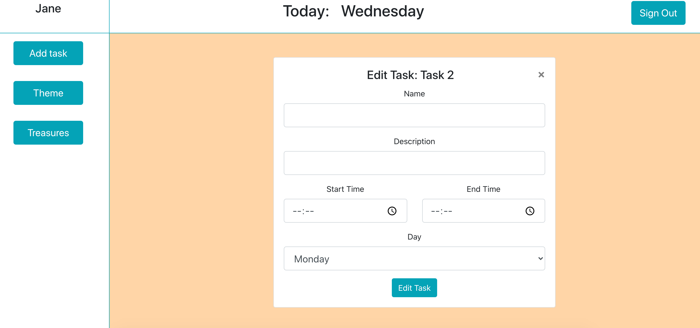
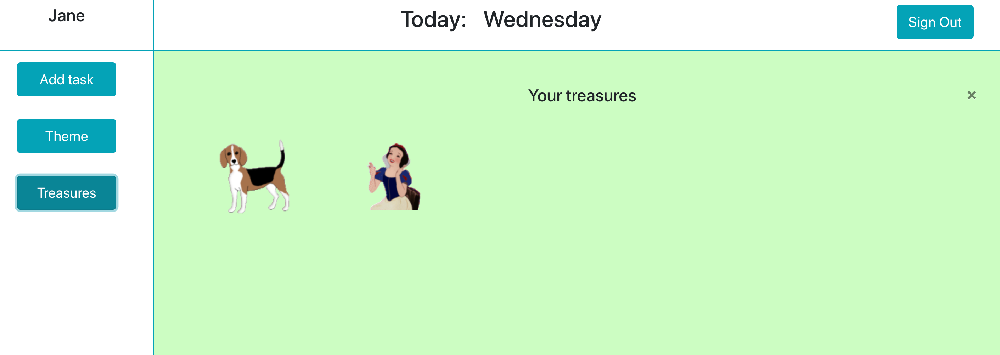
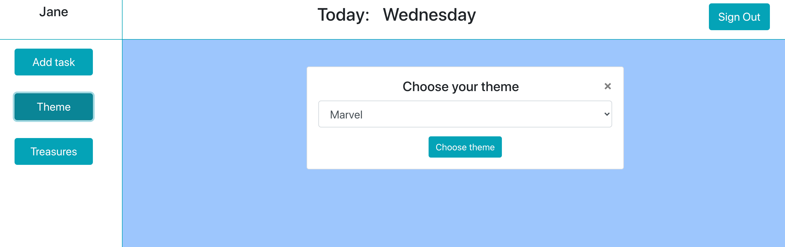

# Kids Calendar

#### React Redux FireBase application, 10/08/2020

#### By _**Evgeniya Chernaya**_

## Description

Kids Calendar application will help kids (users) track their daily tasks and motivate them to do it on time. 

 

## Setup/Installation Requirements

* Clone the repository to your desired directory (in terminal: git clone https://github.com/janecher/kids-schedule.git)
* Do "npm install" in terminal
* Do "npm run start" in the terminal to see the result in browser

## Specification

Component tree

 

* User can sign in and sign up with email/password. User can sigh out with sign out button on user control page

 

* User control page includes: user name, today's week day, sign out buttton, sidebar with button to add a task and see the rewards, button to change sticker's theme, schedule table with days of the week columns 

 

* User can create a task and add it to corresponding part of the schedule table (by days of the week) - end time can't be earlier than start time 

 

* User can click on the task and see details (background color for components change randomly). On details component user can edit, done/undone, and delete task (edit, done, delete buttons)

 

 

* Font color for done tasks changes to green, undone changes back to red color (default color is red)
* For each “done” task user will get a reward (sticker, that appears on stickersPage component) and motivate quote appears for 10 seconds on side bar. User can click on treasures button and see stickerPage component with rewarded stickers

 

* User can choose different sticker themes

 

## FireBase collections

* User collection
* Tasks collection (has userId property)
* Stickers collection (has userId property)

## Known Bugs

_No known bags_

## Support and contact details

Contact me at _evgenya.chernaya@gmail.com_

## Technologies Used

  * React JS
  * Redux
  * JavaScript
  * JSX
  * HTML
  * CSS
  * Bootstrap
  * FireBase, FireStore
  * Webpack
  * npm
  * Git

### License

_This software is licensed under the MIT license_

Copyright (c) 2020 **Evgeniya Chernaya**